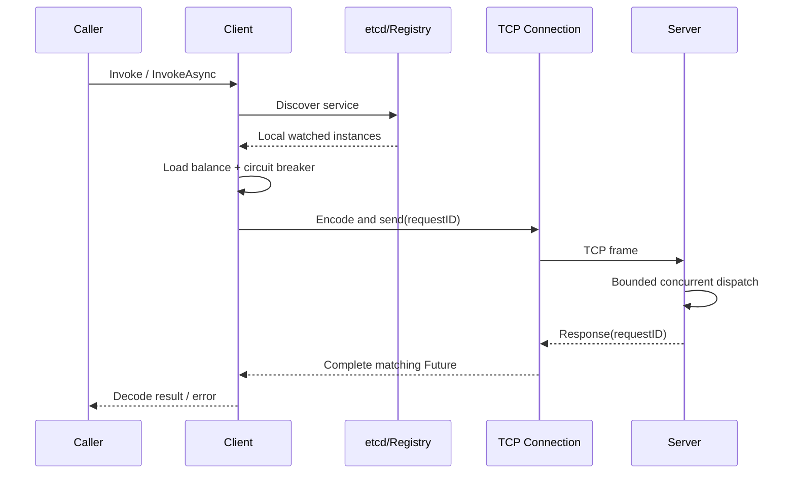

# KanaRPC-Go

[](https://github.com/KanaDoodle/KanaRPC-Go/actions/workflows/ci.yml)
[](go.mod)
[](LICENSE)
[](https://github.com/KanaDoodle/KanaRPC-Go/tags)

用 Go 实现的轻量 RPC 框架，一条 TCP 长连接上跑自定义二进制帧：多路复用、发现、负载均衡、熔断、限流，该有的都有，不该吹的一个不吹。

> 这条鱼是学习型项目，不是生产级框架。它能陪你读完 RPC 的每一层，但别指望它替你在双十一扛流量。

## 这个项目是什么

KanaRPC-Go 是 [KamaRPC-Go](https://github.com/youngyangyang04/KamaRPC-Go) 的衍生学习项目：在上游源码与 Git 历史的基础上，由 KanaDoodle 独立维护。保留上游历史与许可证，不把上游实现声明为原创。

在上游实现之上，本项目重点做了这些事：

- 重构**有界并发调度**，服务端处理能力有明确上限，不会被打爆内存。
- 补齐**请求超时、Future 并发安全、迟到结果隔离**。
- 加入**异常帧防护**：Magic 校验、Header/Body 长度上限、gzip 解压膨胀上限。
- 提供**基础关闭与等待机制**，停止后台任务并撤销本实例创建的租约。
- 处理**注册中心故障**：KeepAlive 丢失、Watch 断流、compaction 后重新同步。
- 补齐**竞态测试、协议模糊测试、CI 与可复现基准**。

## 核心能力

| 能力 | 说明 |
| --- | --- |
| 自定义二进制帧 | `4B` 帧长 + `10B` 固定头（Magic `0x1234`、Header 长度、Body 长度）+ JSON Header + 业务 Body |
| 半包 / 粘包处理 | 长度前缀驱动，支持连续多帧读取 |
| 多路复用 | `requestID + Future`，单连接支持多个并发在途请求，响应可乱序返回 |
| 有界并发 | 服务端并发处理有上限，线程池按连接处理，不会被无界 goroutine 拖垮 |
| 服务注册发现 | etcd Lease + KeepAlive 注册；Watch 按 revision 续接，compaction 后重新同步 |
| 负载均衡 | Round Robin、Random、Weighted Round Robin |
| 容错治理 | 错误率熔断（窗口 10 次 / 阈值 60% / 熔断 5s）、按秒重置额度的请求限流、连接池、请求超时 |
| 序列化 | JSON / Protobuf，两端配置一致时可用；支持 gzip 压缩（在实现层配置，暂无 Codec 协商） |

### 边界防护

- Header 上限 **64 KiB**，Body 上限 **16 MiB**。
- 传输层 Body 上限按压缩后单独计算：`MaxWireBodySize = MaxBodySize + MaxBodySize/100 + 1 KiB`，解压后再校验一次，避免“小压缩包解出大内存”。
- 非法 Magic、超长长度、异常帧一律拒绝，不 panic。

## 调用链路



## 快速开始

公共入口是 `github.com/KanaDoodle/KanaRPC-Go/rpc`，实现类型都留在 `internal/` 里，公共 API 不使用内部类型别名。

```bash
go get github.com/KanaDoodle/KanaRPC-Go
```

先起一个本地 etcd：

```bash
etcd
```

### 服务端

```go
package main

import (
	"log"
	"time"

	"github.com/KanaDoodle/KanaRPC-Go/rpc"
)

type Args struct {
	A int
	B int
}

type Reply struct {
	Result int
}

type Arith struct{}

func (*Arith) Add(args *Args, reply *Reply) error {
	reply.Result = args.A + args.B
	return nil
}

func main() {
	reg, err := rpc.NewRegistry([]string{"127.0.0.1:2379"})
	if err != nil {
		log.Fatal(err)
	}
	defer reg.Close()

	srv, err := rpc.NewServer(rpc.ServerConfig{
		Address:               "127.0.0.1:9090",
		MaxConcurrentRequests: 1024,
	})
	if err != nil {
		log.Fatal(err)
	}
	srv.Register("Arith", &Arith{})
	defer srv.Shutdown()

	go func() {
		if err := srv.Start(); err != nil {
			log.Fatal(err)
		}
	}()

	for srv.Addr() == nil {
		time.Sleep(time.Millisecond)
	}
	if err := reg.Register("Arith", srv.Addr().String(), 10); err != nil {
		log.Fatal(err)
	}
	select {}
}
```

### 客户端

```go
reg, err := rpc.NewRegistry([]string{"127.0.0.1:2379"})
if err != nil {
	log.Fatal(err)
}
defer reg.Close()

cli, err := rpc.NewClient(reg, rpc.ClientConfig{
	Timeout:   time.Second,
	Selection: rpc.RoundRobin, // 或 rpc.Random
})
if err != nil {
	log.Fatal(err)
}
defer cli.Close()

var reply Reply
if err := cli.Invoke(context.Background(), "Arith", "Add", &Args{A: 1, B: 2}, &reply); err != nil {
	log.Fatal(err)
}
log.Println("1 + 2 =", reply.Result)
```

未指定 `Timeout` 时默认 **5s**，`Selection` 留空等价于 `RoundRobin`。方法约定是反射调用 `func(*Req, *Reply) error`。

## 正确性验证

```bash
go test ./...
go test -race ./...
go test ./internal/protocol -fuzz=FuzzDecodeNeverPanics -fuzztime=10s
go vet ./...
```

当前测试覆盖：

- 协议压缩往返、非法 Magic、异常帧长度。
- 半包、粘包和连续多帧读取。
- Future 并发重复完成与延迟注册回调。
- 单连接上两个请求同时进入服务端处理阶段。
- 熔断状态转换、Half-Open 单探针、迟到结果的代次隔离，以及负载均衡边界与权重分布。
- 连接关闭与 pending 清理、拨号和写入取消、服务端关闭接纳竞态、限流器后台任务泄漏及 etcd 注册发现恢复。

### etcd 集成测试

真实 etcd 集成需要独立实例，**不能指向共享或生产 etcd**：测试会执行 compaction。启动一个临时实例后运行：

```bash
docker run -d --name kanarpc-release-etcd -p 127.0.0.1:32379:2379 \
  quay.io/coreos/etcd:v3.6.7 etcd --name kanarpc-release \
  --data-dir=/tmp/etcd-release --listen-client-urls=http://0.0.0.0:2379 \
  --advertise-client-urls=http://127.0.0.1:32379
GOWORK=off KANARPC_TEST_ETCD=127.0.0.1:32379 go test -race -count=1 -timeout=120s -v ./...
docker stop kanarpc-release-etcd
```

不配置 `KANARPC_TEST_ETCD` 时，普通测试会跳过外部 etcd 集成项。容器名与端口须空闲；测试数据留在专用容器中，不使用业务数据卷。

CI 会在 job 内自带一个 etcd 实例，把 `KANARPC_TEST_ETCD` 指过去，所以注册发现、熔断、客户端与公共 facade 的集成用例在 CI 上真的会跑，不会静默 skip。

## 基准测试

测试条件：2026-08-17，Apple M5（10 核）、macOS 26.6.1、Go 1.25.9；客户端、服务端和 etcd 均运行在同一台机器；方法为两个整数相加，单服务实例；压测程序未设置独立预热阶段，启动后即进入统计。

| 并发数 | 持续时间 | 成功请求 | 失败 | QPS | 平均延迟 | P99 |
|---:|---:|---:|---:|---:|---:|---:|
| 1 | 5 s | 25,261 | 0 | 5,052 | 0.20 ms | 0.50 ms |
| 10 | 5 s | 47,492 | 0 | 9,497 | 1.05 ms | 1.89 ms |
| 50 | 10 s | 91,599 | 0 | 9,156 | 5.46 ms | 7.89 ms |
| 100 | 5 s | 45,827 | 0 | 9,148 | 10.92 ms | 12.67 ms |

复现方式：

```bash
go run ./cmd/server1
go run ./cmd/bench2 -c 50 -d 10
```

这些数据用于观察当前实现的相对变化，不代表跨机器或生产环境性能。压测工具源码在 [`cmd/bench2`](cmd/bench2/main.go)，可以直接复现。

## 目录结构

```text
internal/
  breaker/       熔断状态机
  client/        RPC 客户端与调用选项
  codec/         序列化与压缩
  limiter/       请求计数限流（按秒重置，近似固定窗口）
  loadbalance/   负载均衡
  protocol/      帧格式与编解码
  registry/      etcd 注册发现与 Watch 缓存
  server/        服务注册、反射调用和有界并发处理
  transport/     TCP 连接、连接池、Future 与请求映射
cmd/
  server1/       示例服务端
  client/        示例客户端
  bench1/        固定请求数异步压测
  bench2/        固定时长延迟分位压测
rpc/             公共 API facade（对外唯一入口）
pkg/api/         示例服务定义
```

## 设计边界

这一节是本项目最诚实的部分，请按字面理解。

**协议与调用**

- 服务方法使用 `func(req *Req, reply *Reply) error` 反射约定，尚未提供 IDL 代码生成。
- 两端 Codec 必须配置一致，没有协商过程；`Invoke` 的 context 只用于约束等待与网络阶段，**不是**服务端取消协议。
- 客户端在负载均衡前过滤已熔断实例；竞争导致的重新选址次数受发现实例数限制，**不会自动重放已发送的业务请求**（不承诺 exactly-once）。
- 调用方取消不计为后端失败；实际等待/网络阶段的 deadline 仍影响熔断统计。

**注册中心**

- Watch 已支持 revision 续接和 compaction 后全量同步；KeepAlive 结束或租约确认超时后会降级 readiness，以有上限的退避和抖动重新注册。
- 服务发现缓存仍无明确的陈旧时间预算。

**熔断与限流**

- 熔断器使用固定请求窗口（默认 10 次 / 60% / 5s），不是时间滑动窗口。
- 限流器在请求到来时惰性刷新经过的整秒窗口，**没有后台刷新 goroutine**；语义仍是固定窗口额度，不是带独立 burst 容量的标准令牌桶。

**生命周期**

- `Shutdown` 会停止 Accept、关闭现有连接，并等待已启动的连接处理 goroutine 退出；但它没有先 drain 再关连接，也没有统一的关闭 Deadline，因此只是**基础关闭/等待机制，不承诺请求零丢失**。

**性能**

- 当前压测是同机微基准；跨机吞吐还会受网络、内核参数与序列化负载影响。

## 对外使用与发布边界

公共入口为 `github.com/KanaDoodle/KanaRPC-Go/rpc`：

- `Registry` 提供 etcd 端点配置、`Register` / `DiscoverContext`、`Ready` 和 `Close`。
- `ClientConfig` 提供调用超时与轮询/随机选择；`Client.Invoke` 接收 context。
- `Server` 提供处理器注册、`Start`、`Addr` 和 `Shutdown`。

**版本状态**：`v0.1.0` 是公共 facade 的首个发布版本，已推送可解析的 tag。该 tag 之后的 `main` 分支包含一项协议安全修复（把传输层 Body 长度上限与解压后的 Body 上限分开计算，见 commit `1ab72d0`）以及 CI 的 etcd 集成增强；公共 `rpc` facade 的签名**未发生变化**。依赖方需要该修复时请使用 `main` 或等待下一个 tag。

**依赖建议**：外部项目应依赖本仓库已推送且可解析的版本 tag，并在 `GOWORK=off`、无 sibling checkout 或本地 replace 的环境验证。开发 workspace（`go.work`）仅用于本地联调，不能代替远程版本验收。

`v0.x` 系列 API 尚未承诺长期稳定。

### 每服务独立选择状态（release repair）

公共 `Client` 调用多个服务时，会为每个服务维护独立的 round-robin / random 策略实例，保留各自服务的探测机会。熔断器仍按服务 + 地址隔离，half-open 的 `Acquire` 门控不变，不会自动重放任何已发送的业务 RPC。每服务的均衡器条目与 `Client` 同生命周期，`Close` 时清理；单个长生命周期 `Client` 运行期间的服务变更不会被主动驱逐。内部自定义均衡器必须提供 `NewBalancer() LoadBalancer` 以构造独立状态；公共 facade 的既有策略配置不变。

## 许可证与修改说明

保留上游原始 [LICENSE](LICENSE)：GNU Affero General Public License, Version 3（AGPL v3）。

修改记录日期：2026-09-10。相对保留的上游提交，本项目修改了 module 路径、公共 RPC facade、客户端/服务端生命周期、协议与并发安全、熔断与负载均衡、注册恢复，并补充测试与文档。后续公开分发应继续保留上游来源与许可证。

---

<sub>README 由一条蓝色大肥鱼协助整理：所有能力描述都能在代码里找到对应实现，找不到的那部分写进了「设计边界」。</sub>
