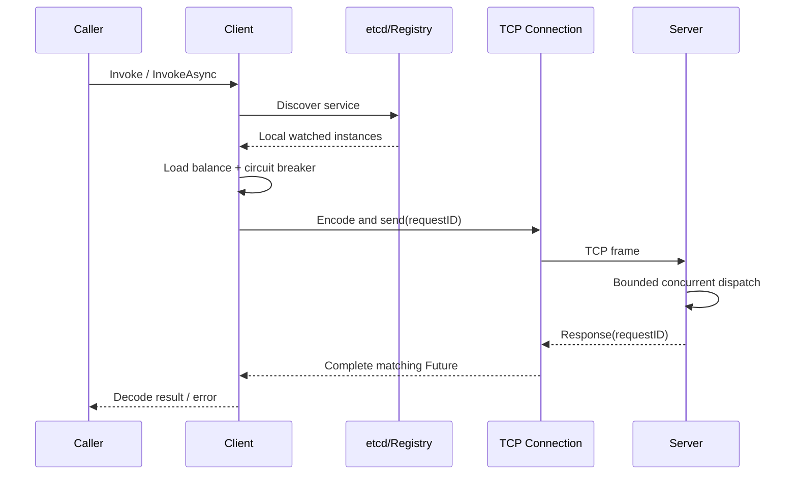

# KanaRPC-Go

[](https://github.com/KanaDoodle/KanaRPC-Go/actions/workflows/ci.yml)
[](go.mod)
[](LICENSE)
[](https://github.com/KanaDoodle/KanaRPC-Go/releases)

用 Go 实现的轻量 RPC 框架：一条 TCP 长连接，自定义二进制帧，在此之上提供多路复用、服务发现、负载均衡、熔断与限流。

功能上该有的基本都有，但**它不面向生产环境**。

> ⚠️ **这是个练习项目。** 用途是把 RPC 的每一层拆开、读一遍、改一遍、测一遍；不适合承担生产流量。

代码底子是 [KamaRPC-Go](https://github.com/youngyangyang04/KamaRPC-Go) 的衍生学习项目，由 KanaDoodle 维护。上游历史与许可证全部保留，上游实现不冒充原创。

## 能做什么

| 能力 | 说明 |
| --- | --- |
| 自定义二进制帧 | `4B` 帧长 + `10B` 固定头（Magic `0x1234`、Header 长度、Body 长度）+ JSON Header + 业务 Body |
| 半包 / 粘包处理 | 长度前缀驱动，支持连续多帧读取 |
| 多路复用 | `requestID + Future`，单连接支持多个并发在途请求，响应可乱序返回 |
| 有界并发 | 服务端并发处理有明确上限，按连接调度，不会被无界 goroutine 拖垮 |
| 服务注册发现 | etcd Lease + KeepAlive 注册；Watch 按 revision 续接，compaction 后重新同步 |
| 负载均衡 | Round Robin、Random、Weighted Round Robin |
| 容错治理 | 错误率熔断（窗口 10 次 / 阈值 60% / 熔断 5s）、按秒重置额度的请求限流、连接池、请求超时 |
| 序列化 | JSON / Protobuf，两端配置一致时可用；支持 gzip 压缩（在实现层配置，暂无 Codec 协商） |

在上游基础上补的是这些：

- **有界并发调度**——服务端并发处理有明确上限，池满即排队；不会因无界 goroutine 耗尽资源。
- **请求超时、Future 并发安全、迟到结果隔离**——重复完成与迟到的响应不会唤醒错误的 Future。
- **异常帧防护**——Magic 校验、Header/Body 长度上限、gzip 解压膨胀上限。
- **基础关闭与等待机制**——停止后台任务，撤销本实例创建的租约。
- **注册中心故障恢复**——KeepAlive 丢失、Watch 断流、compaction 之后均能重新注册同步。
- **竞态测试、协议模糊测试、CI 与可复现基准**——最不显眼，但最值钱。

### 长度字段校验

「长度由对端说了算」是这类协议最容易翻车的地方，翻车后的典型后果是内存耗尽：

- Header 上限 **64 KiB**，Body 上限 **16 MiB**。
- 传输层 Body 上限按压缩后单独计算：`MaxWireBodySize = MaxBodySize + MaxBodySize/100 + 1 KiB`，解压完成后再次校验。防的就是一个很小的压缩包解出几十兆内存。
- 非法 Magic、超长长度、异常帧一律拒收，不 panic。

## 调用链路



落到代码上要过五步：

1. **发现**——从 Registry 的本地 Watch 缓存里取可用实例。
2. **选址**——先剔掉已熔断的实例，剩下的交给负载均衡器挑一个。
3. **编码**——按 `requestID` 打包成帧，写进连接池里那条长连接。
4. **派发**——服务端交给有界并发池，池满就排队，不无限开 goroutine。
5. **归位**——响应回来按 `requestID` 唤醒对应的 Future，乱序回来也不会认错人。

## 快速开始

对外只有一个包：`github.com/KanaDoodle/KanaRPC-Go/rpc`。实现类型全部待在 `internal/` 里，公共 API 不暴露内部类型别名。

```bash
go get github.com/KanaDoodle/KanaRPC-Go
```

本地 etcd 先起着：

```bash
etcd
```

### 服务端

```go
package main

import (
	"log"
	"time"

	"github.com/KanaDoodle/KanaRPC-Go/rpc"
)

type Args struct {
	A int
	B int
}

type Reply struct {
	Result int
}

type Arith struct{}

func (*Arith) Add(args *Args, reply *Reply) error {
	reply.Result = args.A + args.B
	return nil
}

func main() {
	reg, err := rpc.NewRegistry([]string{"127.0.0.1:2379"})
	if err != nil {
		log.Fatal(err)
	}
	defer reg.Close()

	srv, err := rpc.NewServer(rpc.ServerConfig{
		Address:               "127.0.0.1:9090",
		MaxConcurrentRequests: 1024,
	})
	if err != nil {
		log.Fatal(err)
	}
	srv.Register("Arith", &Arith{})
	defer srv.Shutdown()

	go func() {
		if err := srv.Start(); err != nil {
			log.Fatal(err)
		}
	}()

	for srv.Addr() == nil {
		time.Sleep(time.Millisecond)
	}
	if err := reg.Register("Arith", srv.Addr().String(), 10); err != nil {
		log.Fatal(err)
	}
	select {}
}
```

### 客户端

```go
reg, err := rpc.NewRegistry([]string{"127.0.0.1:2379"})
if err != nil {
	log.Fatal(err)
}
defer reg.Close()

cli, err := rpc.NewClient(reg, rpc.ClientConfig{
	Timeout:   time.Second,
	Selection: rpc.RoundRobin, // 或 rpc.Random
})
if err != nil {
	log.Fatal(err)
}
defer cli.Close()

var reply Reply
if err := cli.Invoke(context.Background(), "Arith", "Add", &Args{A: 1, B: 2}, &reply); err != nil {
	log.Fatal(err)
}
log.Println("1 + 2 =", reply.Result)
```

### 三个已经踩过的坑，别再踩

- `Timeout` 不填默认 **5s**；`Selection` 留空等价于 `RoundRobin`。
- 方法约定是反射调用 `func(*Req, *Reply) error`，第二个参数必须是**出参指针**。传值进去调用不会报错，但结果恒为零值——很容易查很久。
- 必须等 `Start()` 之后 `Addr()` 有值再注册。上面那句 `for srv.Addr() == nil` 就是做这件事的；监听写 `:0` 时若提前注册，写进 etcd 的地址是空的。

## 正确性验证

```bash
go test ./...
go test -race ./...
go test ./internal/protocol -fuzz=FuzzDecodeNeverPanics -fuzztime=10s
go vet ./...
```

测试专挑「出了问题最难查」的地方下手：

- 协议压缩往返、非法 Magic、异常帧长度。
- 半包、粘包和连续多帧读取。
- Future 并发重复完成与延迟注册回调。
- 单连接上两个请求同时进入服务端处理阶段。
- 熔断状态转换、Half-Open 单探针、迟到结果的代次隔离，以及负载均衡边界与权重分布。
- 连接关闭与 pending 清理、拨号和写入取消、服务端关闭接纳竞态、限流器后台任务泄漏及 etcd 注册发现恢复。

### etcd 集成测试

需要独立的测试实例：**不能指向共享或生产 etcd**，这些用例是真的会建租约、真的会执行 compaction。

```bash
docker run -d --name kanarpc-release-etcd -p 127.0.0.1:32379:2379 \
  quay.io/coreos/etcd:v3.6.7 etcd --name kanarpc-release \
  --data-dir=/tmp/etcd-release --listen-client-urls=http://0.0.0.0:2379 \
  --advertise-client-urls=http://127.0.0.1:32379
GOWORK=off KANARPC_TEST_ETCD=127.0.0.1:32379 go test -race -count=1 -timeout=120s -v ./...
docker stop kanarpc-release-etcd
```

不设 `KANARPC_TEST_ETCD` 时这些用例会跳过。容器名和端口得是空的，测试数据留在专用容器里，不碰业务数据卷。

CI 在 job 里自带一个 etcd 并设好 `KANARPC_TEST_ETCD`，所以注册发现、熔断、客户端与公共 facade 的集成用例在 CI 上是**真跑**的——只在自己机器上跑过的测试，跟没跑区别不大。

## 基准测试

测试条件：2026-08-17，Apple M5（10 核）、macOS 26.6.1、Go 1.25.9；客户端、服务端、etcd 在同一台机器上；方法就是两个整数相加，单服务实例；压测程序没有独立预热阶段，启动即统计。

| 并发数 | 持续时间 | 成功请求 | 失败 | QPS | 平均延迟 | P99 |
|---:|---:|---:|---:|---:|---:|---:|
| 1 | 5 s | 25,261 | 0 | 5,052 | 0.20 ms | 0.50 ms |
| 10 | 5 s | 47,492 | 0 | 9,497 | 1.05 ms | 1.89 ms |
| 50 | 10 s | 91,599 | 0 | 9,156 | 5.46 ms | 7.89 ms |
| 100 | 5 s | 45,827 | 0 | 9,148 | 10.92 ms | 12.67 ms |

自己复现：

```bash
go run ./cmd/server1
go run ./cmd/bench2 -c 50 -d 10
```

同机微基准，只能用于观察实现的相对变化，不代表跨机器性能，更不代表生产表现。压测代码在 [`cmd/bench2`](cmd/bench2/main.go)，参数可以自行修改。

## 当前的边界

下面每一条都是**当前实现就到此为止**，不是「以后会做」的计划。把限制写在前面，比让人踩上去再解释便宜。

**协议与调用**

- 服务方法靠 `func(req *Req, reply *Reply) error` 反射约定，**没有 IDL 代码生成**。
- 两端 Codec 必须配置一致，没有协商；`Invoke` 的 context 只约束等待和网络阶段，**不是**服务端取消协议。
- 客户端在负载均衡前先过滤已熔断实例；竞争导致的重新选址次数受发现实例数限制，**不会自动重放已经发出去的业务请求**（不承诺 exactly-once）。
- 调用方取消不算后端失败；但实际等待/网络阶段的 deadline 依然影响熔断统计。

**注册中心**

- Watch 支持 revision 续接和 compaction 后全量同步；KeepAlive 结束或租约确认超时后降级 readiness，再有上限退避加抖动地重新注册。
- 服务发现缓存**没有明确的陈旧时间预算**。

**熔断与限流**

- 熔断器是**固定请求窗口**（默认 10 次 / 60% / 5s），不是时间滑动窗口。
- 限流器在请求到来时惰性刷新经过的整秒窗口，**没有后台刷新 goroutine**；语义是固定窗口额度，不是带独立 burst 容量的标准令牌桶。

**生命周期**

- `Shutdown` 会停 Accept、关现有连接，并等已启动的连接处理 goroutine 退出。但它**没有先 drain 再关连接**，也没有统一的关闭 Deadline——基础关闭/等待机制，**不承诺请求零丢失**。

**性能**

- 只有同机微基准。跨机吞吐还取决于网络、内核参数与序列化负载，这里不做推测。

## 拿来用

公共入口就一个：`github.com/KanaDoodle/KanaRPC-Go/rpc`。

- `Registry`——etcd 端点配置、`Register` / `DiscoverContext`、`Ready`、`Close`。
- `ClientConfig`——调用超时和轮询/随机选择；`Client.Invoke` 接 context。
- `Server`——处理器注册、`Start`、`Addr`、`Shutdown`。

### 版本状态

| 版本 | 状态 | 内容 |
| --- | --- | --- |
| [`v0.1.1`](https://github.com/KanaDoodle/KanaRPC-Go/releases/tag/v0.1.1) | **推荐** | 含协议安全修复：传输层 Body 长度上限与解压后的上限分开算（commit `1ab72d0`），另有 CI 的 etcd 集成增强 |
| [`v0.1.0`](https://github.com/KanaDoodle/KanaRPC-Go/releases/tag/v0.1.0) | 建议升级 | 公共 facade 的首个版本，**不含**上面那个修复 |

两个版本之间公共 `rpc` facade 签名**没变**，升级就是换个 tag，代码不用动。还在 `v0.1.0` 的建议升一下——那个修复管的是压缩体长度校验，属于边界防护。升级确实烦，但这次值得。

外部项目请依赖本仓库**已推送且能解析的 tag**，并在 `GOWORK=off`、没有 sibling checkout 也没有本地 replace 的环境里验一遍。开发用的 workspace（`go.work`）只适合本地联调，代替不了远程版本验收。

`v0.x` 系列 API 还没承诺长期稳定。

每个服务的均衡器状态互相独立：`Client` 调用多个服务时，各服务各自维护 round-robin / random 策略实例；熔断器按「服务 + 地址」隔离，不会自动重放任何已发出去的业务 RPC。均衡器条目与 `Client` 同生命周期，`Close` 时清掉；单个长生命周期 `Client` 运行期间，服务变更不会被主动驱逐。

### 目录结构

```text
internal/
  breaker/       熔断状态机
  client/        RPC 客户端与调用选项
  codec/         序列化与压缩
  limiter/       请求计数限流（按秒重置，近似固定窗口）
  loadbalance/   负载均衡
  protocol/      帧格式与编解码
  registry/      etcd 注册发现与 Watch 缓存
  server/        服务注册、反射调用和有界并发处理
  transport/     TCP 连接、连接池、Future 与请求映射
cmd/
  server1/       示例服务端
  client/        示例客户端
  bench1/        固定请求数异步压测
  bench2/        固定时长延迟分位压测
rpc/             公共 API facade（对外唯一入口）
pkg/api/         示例服务定义
```

## 出处与许可证

保留上游原始 [LICENSE](LICENSE)：GNU Affero General Public License, Version 3（AGPL v3）。

修改记录日期：2026-09-10。相对保留的上游提交，本项目改了 module 路径、公共 RPC facade、客户端/服务端生命周期、协议与并发安全、熔断与负载均衡、注册恢复，并补了测试和文档。后续公开分发请继续保留上游来源与许可证。

---

<sub>🐟 这条鱼是个练习项目：吃白饭、爱摸鱼，能力也就到此为止。上面写的每个「能」都能在代码里找到对应实现；找不到的，都在「当前的边界」那节老实写着。</sub>
