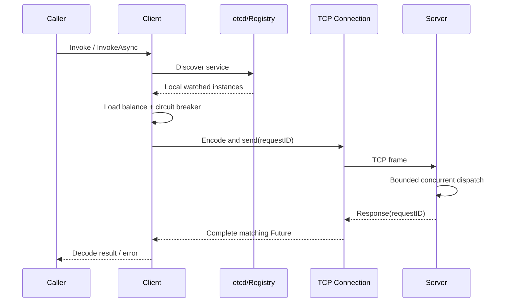

# KanaRPC-Go

一个使用 Go 实现的轻量 RPC 框架练习项目，重点覆盖 TCP 长连接、自定义协议、请求多路复用、服务发现、负载均衡与容错治理。

> 项目说明：本项目是基于 [KamaRPC-Go](https://github.com/youngyangyang04/KamaRPC-Go) 源码与 Git 历史的衍生学习项目，当前由 KanaDoodle 独立维护；保留上游历史和许可证，不将上游实现声明为原创。在原有学习实现基础上，重点重构了有界并发调度、请求超时与 Future 并发安全、异常帧防护、基础关闭与等待机制和注册中心故障处理，并补齐竞态测试、协议模糊测试、CI 与可复现基准测试。

## 核心能力

- 自定义二进制帧：Magic、Header 长度、Body 长度、JSON Header 与业务 Body。
- 半包/粘包处理，并限制 64 KiB Header、16 MiB 传输 Body 与 gzip 解压后的 Body，避免异常长度和解压膨胀耗尽内存。
- 基于 `requestID + Future` 的请求多路复用，单连接支持多个并发在途请求。
- 服务端采用有界并发处理；响应可乱序返回，并由客户端按 requestID 唤醒对应 Future。
- etcd Lease + KeepAlive 完成服务注册，Watch 按 revision 续接并在 compaction 后重新同步；关闭时停止后台任务并撤销本实例创建的租约。
- Round Robin、Random、Weighted Round Robin 负载均衡。
- 错误率熔断、按秒重置额度的请求计数限流、连接池、请求超时与基础关闭/等待机制。
- 两端配置一致时支持 JSON / Protobuf 请求与响应，支持 gzip 压缩；尚无 Codec 协商。

## 调用链路



## 正确性验证

```bash
go test ./...
go test -race ./...
go test ./internal/protocol -fuzz=FuzzDecodeNeverPanics -fuzztime=10s
go vet ./...
```

当前测试覆盖：

- 协议压缩往返、非法 Magic、异常帧长度。
- 半包、粘包和连续多帧读取。
- Future 并发重复完成与延迟注册回调。
- 单连接上两个请求同时进入服务端处理阶段。
- 熔断状态转换、Half-Open 单探针、迟到结果的代次隔离，以及负载均衡边界与权重分布。
- 连接关闭与 pending 清理、拨号和写入取消、服务端关闭接纳竞态、限流器后台任务泄漏及 etcd 注册发现恢复。

真实 etcd 集成需要独立的测试实例，不能指向共享或生产 etcd：测试会执行 compaction。启动一个临时实例后运行：

```bash
docker run -d --name kanarpc-release-etcd -p 127.0.0.1:32379:2379 \
  quay.io/coreos/etcd:v3.6.7 etcd --name kanarpc-release \
  --data-dir=/tmp/etcd-release --listen-client-urls=http://0.0.0.0:2379 \
  --advertise-client-urls=http://127.0.0.1:32379
GOWORK=off KANARPC_TEST_ETCD=127.0.0.1:32379 go test -race -count=1 -timeout=120s -v ./...
docker stop kanarpc-release-etcd
```

不配置 `KANARPC_TEST_ETCD` 时，普通测试会跳过外部 etcd 集成项。容器名称和端口须空闲；测试数据留在专用容器中，不使用业务数据卷。

## 快速运行

先启动本地 etcd：

```bash
etcd
```

再分别启动服务端和基准测试：

```bash
go run ./cmd/server1
go run ./cmd/bench2 -c 50 -d 10
```

## 基准测试

测试条件：2026-08-17，Apple M5（10 核）、macOS 26.6.1、Go 1.25.9；客户端、服务端和 etcd 均运行在同一台机器；方法为两个整数相加，单服务实例；压测程序未设置独立预热阶段，启动后即进入统计。

| 并发数 | 持续时间 | 成功请求 | 失败 | QPS | 平均延迟 | P99 |
|---:|---:|---:|---:|---:|---:|---:|
| 1 | 5 s | 25,261 | 0 | 5,052 | 0.20 ms | 0.50 ms |
| 10 | 5 s | 47,492 | 0 | 9,497 | 1.05 ms | 1.89 ms |
| 50 | 10 s | 91,599 | 0 | 9,156 | 5.46 ms | 7.89 ms |
| 100 | 5 s | 45,827 | 0 | 9,148 | 10.92 ms | 12.67 ms |

这些数据用于观察当前实现的相对变化，不代表跨机器或生产环境性能。基准工具源码位于 `cmd/bench2`，可直接复现。

## 目录结构

```text
internal/
  breaker/       熔断状态机
  client/        RPC 客户端与调用选项
  codec/         序列化与压缩
  limiter/       请求计数限流（按秒重置，近似固定窗口）
  loadbalance/   负载均衡
  protocol/      帧格式与编解码
  registry/      etcd 注册发现与 Watch 缓存
  server/        服务注册、反射调用和有界并发处理
  transport/     TCP 连接、连接池、Future 与请求映射
cmd/
  server1/       示例服务端
  client/        示例客户端
  bench1/        固定请求数异步压测
  bench2/        固定时长延迟分位压测
```

## 设计边界

- 当前服务方法采用 `func(req *Req, reply *Reply) error` 反射调用约定，尚未提供 IDL 代码生成。
- etcd Watch 已支持 revision 续接和 compaction 后全量同步；KeepAlive 结束或租约确认超时后会降级 readiness，以有上限的退避和抖动重新注册；服务发现缓存仍无明确的陈旧时间预算。
- 熔断器使用固定请求窗口，不是时间滑动窗口。
- 限流器在请求到来时惰性刷新经过的整秒窗口，无后台刷新 goroutine；语义仍为固定窗口额度，不是连续补充且带独立 burst 容量的标准令牌桶。
- Shutdown 会停止 Accept、关闭现有连接，并等待已启动的连接处理 goroutine 退出；由于它没有先 drain 再关连接，也没有统一的关闭 Deadline，因此只能视为基础关闭/等待机制，不能承诺请求零丢失。
- 当前压测是同机微基准；跨机吞吐还会受到网络、内核参数与序列化负载影响。


## 对外使用与发布边界

公共入口为 `github.com/KanaDoodle/KanaRPC-Go/rpc`。`Registry` 提供 etcd 端点配置、地址注册/发现、`Ready` 和 `Close`；`ClientConfig` 提供调用超时与轮询/随机选择；`Client.Invoke` 接收 context；`Server` 提供处理器注册、启动、地址和关闭。实现类型继续保留在 `internal/`，公共 API 不使用内部类型别名。

客户端在负载均衡前过滤已熔断实例，竞争导致的重新选址次数受发现实例数限制，不会自动重放已发送的业务请求。调用方取消不计为后端失败；实际等待/网络阶段的 deadline 仍影响熔断。KeepAlive 丢失后申请新 lease 并恢复注册，`Registry.Ready()` 在未注册、降级或关闭时返回 false。

公共 facade 的首个发布系列使用 `v0.x`，当前准备版本为 `v0.1.0`；API 尚未承诺长期稳定。外部项目应依赖本仓库已推送且可解析的版本 tag，并在 `GOWORK=off`、无 sibling checkout 或本地 replace 的环境验证。开发 workspace 仅用于本地联调，不能代替远程版本验收。

### Per-service selection state (release repair)

A public Client calling multiple services maintains independent round-robin/random strategy instances per service, preserving each service's probe opportunities. Breakers remain keyed by service and address, with the half-open Acquire gate unchanged. No transmitted business RPC is automatically replayed. Per-service balancer entries last for the Client lifetime and are cleared on Close; service churn during a single long-lived Client is not actively evicted. Internal custom balancers must provide `NewBalancer() LoadBalancer` to construct independent state; the public facade's existing strategy configuration is unchanged.


## 许可证与修改说明

保留上游原始 [LICENSE](LICENSE)：GNU Affero General Public License，Version 3（AGPL v3）。修改记录日期：2026-09-10。相对保留的上游提交，本项目修改了 module 路径、公共 RPC facade、客户端/服务端生命周期、协议与并发安全、熔断与负载均衡、注册恢复，并补充测试与文档。后续公开分发应继续保留上游来源和许可证。
